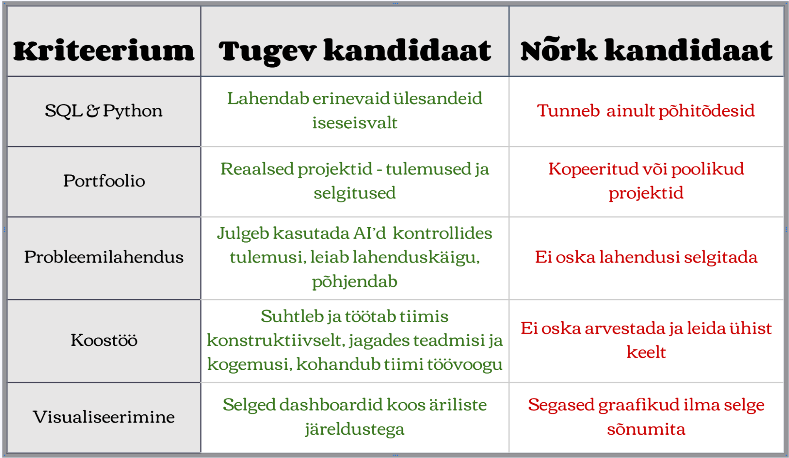

VÄRBAMISJUHENDI PEATÜKID 1 ja 2: Kuidas hinnata DA tehnilisi oskusi ja portfooliot

Meeskond: Turundusanalüüsi osakonna meeskond  
UrbanStyle juht: Toomas Kask (IT Director) ja Kristi Tamm (CEO)

1\. ÜLEVAADE  
See peatükk käsitleb, kuidas hinnata Data Analysti tehnilisi oskusi ja portfooliot värbamisprotsessi käigus. Lisaks teadmiste kontrollimisele on oluline vaadata kandidaadi varasemaid projekte, sest need näitavad praktilist kogemust, probleemilahendusoskust ja töö kvaliteeti.

2\. HINDAMISKRITEERIUMID

* Tehnilised oskused:  
  * SQL päringute kirjutamine  
  * Python ja Pandas kasutamine  
  * Exceli või Power BI oskus  
  * Andmete puhastamine ja visualiseerimine

* Portfoolio hindamine  
  * kas GitHub sisaldab reaalseid projekte  
  * projektide kvaliteet vs lihtsalt suur hulk faile  
  * kas kood on loetav ja dokumenteeritud  
  * kas kandidaat seletab oma töö eesmärki ja tulemusi

* Probleemilahendus  
  * kandidaat oskab selgitada oma mõtlemist  
  * lahendab ülesandeid loogiliselt  
  * märkab andmetes vigu

3\. KONKREETSED NÄITED (UrbanStyle kontekst)  
  Tugev kandidaat UrbanStyle jaoks:

* kirjutab SQL päringu, mis leiab enim müüdud tooted  
  * kasutab Pythonit müügiandmete analüüsimiseks  
  * loob dashboardi müügitrendide jälgimiseks  
  * omab GitHubis projekte, kus on näha päris andmete kasutamist  
  * suudab teha koostööd teiste osapooltega, et leida andmetest trende ja aidata teha paremaid äriotsuseid

Näiteks võiks kandidaat näidata:

* müügianalüüsi projekti  
  * kliendikäitumise analüüsi  
  * Power BI dashboardi  
  * hästi dokumenteeritud GitHub repository’t

4\. 3 VÕTMESOOVITUST JUHILE  
Soovitus 1: Kasuta intervjuul praktilisi SQL või Python ülesandeid.  
Soovitus 2: Hinda portfoolios kvaliteeti, süsteemsust mitte kvantiteeti\!  
Soovitus 3: Palu kandidaadil oma projekti lahti seletada, et kontrollida päris teadmisi.

5\. ÜLLATAV AVASTUS  
Mõnikord näitab üks hästi tehtud praktiline projekt kandidaadi oskusi rohkem kui pikk CV või suur hulk sertifikaate.
